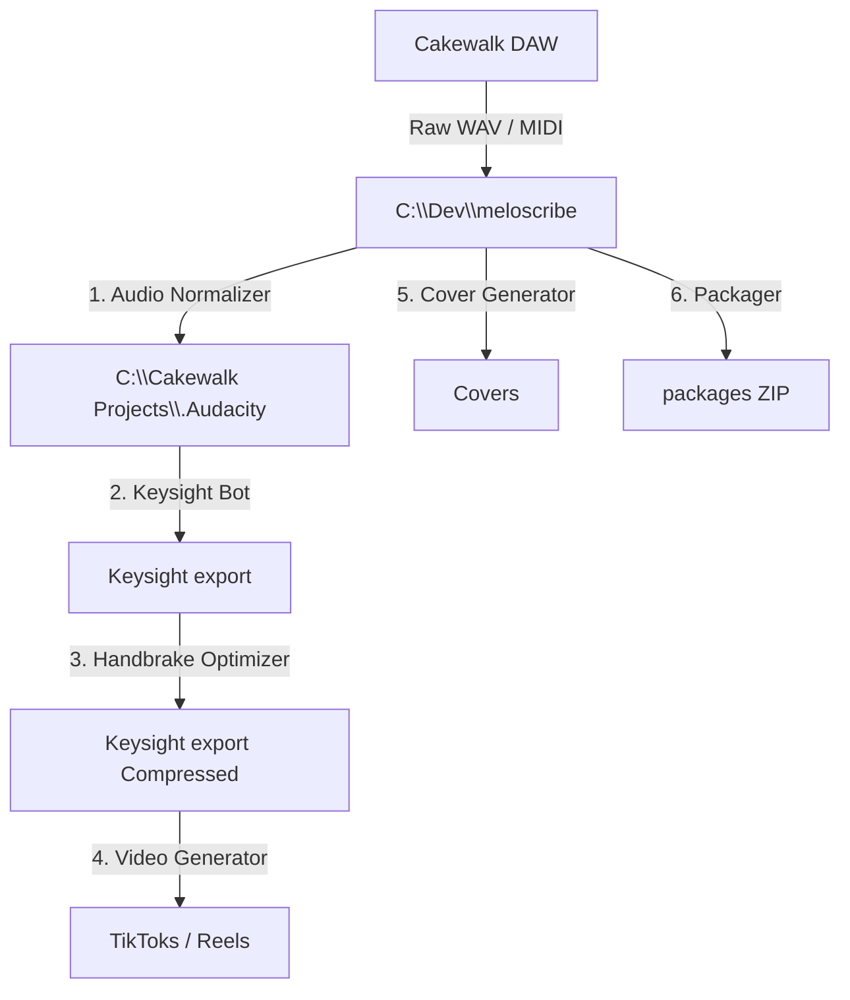

# Meloscribe Project Status & Roadmap

Living documentation tracking the development, architecture, and active tasks of Meloscribe.

## Project State

Meloscribe is an automation pipeline to streamline piano tutorial creation, editing, packaging, and social media posting. 

The workspace transition to the new PC environment is complete:
- Working directory: `C:\Dev\meloscribe`
- verified Keysight path on C: drive (`C:\Program Files (x86)\Steam\steamapps\common\Keysight\Keysight\Binaries\Win64\Keysight-Win64-Shipping.exe`)
- The pipeline now dynamically handles YouTube/Facebook formats based on video duration.
- The new desktop shortcut and unified browser profiles are successfully deployed.
- The Oracle OCI Sniper control dashboard is integrated directly into the React/FastAPI desktop app.

## Active Roadmap

- [x] Complete new PC path migration across all scripts and frontend components (Keysight, MuseScore, Uploads).
- [x] Implement automatic MuseScore template preparation and double-instance launching.
- [x] Resolve MuseScore launch race conditions and implement template fallbacks.
- [x] Repair and optimize Desktop `check_sniper.bat` with non-blocking SSH validation.
- [x] Enable startup-time auto-creation of output and staging directories.
- [x] Clean up redundant endpoints in `main.py` FastAPI backend.
- [x] Integrate Audio Normalization and Handbrake Compression into Phase 1 of the One-Click Workflow.
- [x] Implement dynamic Shorts vs. Long-form video formatting on YouTube and Facebook based on video length.
- [x] Integrate Pushbullet support to send TikTok descriptions directly to your phone.
- [x] Add Oracle Server control panel directly inside the React/FastAPI application.
- [x] Share user's main Brave browser profile across all Playwright automation scripts.
- [x] Auto-generate Desktop launcher shortcut at startup.
- [x] Implement server scheduled upload queue management (view staged filenames, reschedule, delete pending tasks).
- [x] Implement browser-based one-click OAuth flows for Instagram and Threads with manual fallback options.
- [x] Implement connection state validation and warnings before workflow launch, and disable active buttons if already connected.
- [x] Add real-time granular SCP progress reporting per file upload for a smoother progress bar response.
- [x] Fix background process browser-opening issues by launching via Windows native Shell (os.startfile) to support already-running instances.
- [x] Create comprehensive Social Media & Distribution Strategy guide at [social_media_concept.md](file:///c:/Dev/meloscribe/social_media_concept.md).
- [x] Verify standalone Website Catalog Sync module functionality in the app's manual overrides (Website Catalog management via `website_add` route)
- [x] Install git, nginx, certbot, and sqlite3 on Oracle VM
- [x] Configure Nginx reverse proxy on Oracle VM mapping api.meloscribe.dev to port 8787
- [x] Manually deploy Paddle webhook & R2 download endpoints to Oracle VM backend and run database migration
- [x] Configure Git repository on Oracle VM to allow manual git pull deployment


## Architecture & Data Flow



## Infrastructure & Hosting Architecture (meloscribe.dev)

This section documents the infrastructure, network security, and deployment layout established on **2026-06-25** to host the Meloscribe platform securely and for free.

### 1. Domain & DNS Control (Cloudflare)
The domain `meloscribe.dev` is registered on **Spaceship**. The domain nameservers are pointed to **Cloudflare** for unified DNS dashboard management, SSL edge security, and DDoS protection.

**DNS Settings (Cloudflare):**
- `meloscribe.dev` (Apex) -> `A` Record -> `76.76.21.21` (Vercel Anycast IP) | DNS Only (Graue Wolke)
- `www.meloscribe.dev` -> `CNAME` Record -> `cname.vercel-dns.com` | DNS Only (Graue Wolke)
- `api.meloscribe.dev` -> `A` Record -> `152.70.23.171` (Oracle VM Public IP) | DNS Only (Graue Wolke)

### 2. Frontend Hosting (Vercel)
- **Source Code**: React/Vite/TS SPA codebase is located in the GitHub repository `meloscribe-website`.
- **Deployment Flow**: Linked directly to Vercel. Every push to the `main` branch triggers an automated build and deploy.
- **Analytics**: Vercel Analytics integration tracks views and demographics without requiring a cookie consent banner.

### 3. Backend Hosting (Oracle Cloud VM)
- **Infrastructure**: Oracle Cloud Infrastructure (OCI) Free-Tier Ubuntu 24.04 LTS Instance (`152.70.23.171`).
- **Web Server & Reverse Proxy**: Nginx proxypasses public HTTPS requests for `api.meloscribe.dev` to localhost port `8787` (Uvicorn running FastAPI).
- **SSL Certificate**: Let's Encrypt TLS certificate generated via Certbot. Automatic renewal is handled by `certbot.timer` systemd service.
  - Certificate Paths:
    - Full Chain: `/etc/letsencrypt/live/api.meloscribe.dev/fullchain.pem`
    - Private Key: `/etc/letsencrypt/live/api.meloscribe.dev/privkey.pem`

**Firewall Configuration:**
1. **OCI Cloud Security List (Ingress Rules)**:
   - TCP Port 80 (`0.0.0.0/0`) allowed for Let's Encrypt validation.
   - TCP Port 443 (`0.0.0.0/0`) allowed for public HTTPS API access.
2. **Ubuntu OS Firewall (iptables)**:
   - Configured to allow traffic on port 80 and 443 before the default reject rule, persisted via `netfilter-persistent save`.

**systemd Services:**
- **FastAPI Backend**: `meloscribe-backend.service`
  - WorkingDirectory: `/home/ubuntu/meloscribe/tools/meloscribe/backend`
  - ExecStart: `/home/ubuntu/meloscribe/venv/bin/uvicorn main:app --host 0.0.0.0 --port 8787`
  - Logs: Configured via service redirection to `/home/ubuntu/meloscribe/tools/meloscribe/backend/uploader.log`.
- **OCI Sniper**: `oci-sniper.service`
- **OCI Uploader**: `oci-uploader.service`

**Manual Deployment Flow**:
Deployments are pulled manually on the server from the `https://github.com/Ventoba/meloscribe.git` repository:
```bash
cd /home/ubuntu/meloscribe
git pull origin main
sudo systemctl restart meloscribe-backend
```

